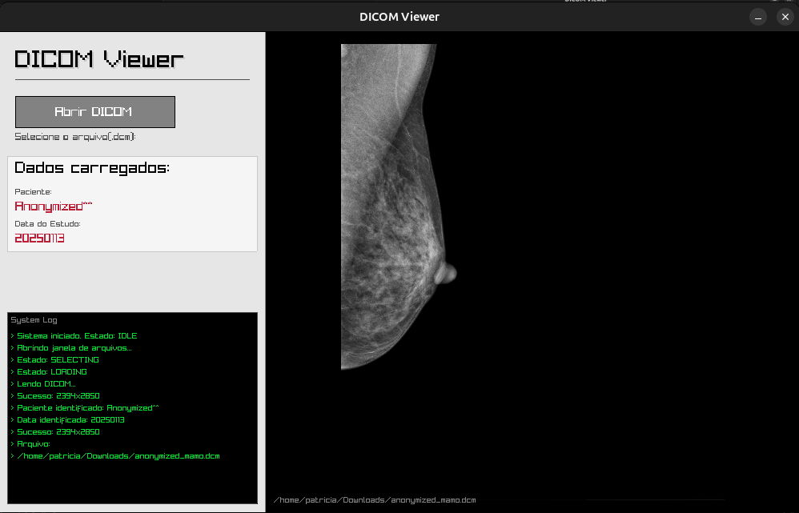

# DicomViewer



## Description
DicomViewer is a C++ project developed to fulfill the requirements of the technical test for the **C++ Developer position at Dr.Tis**.

The project focuses on building a simple graphical DICOM viewer, emphasizing clean code, modern C++ practices, and cross-platform build configuration using CMake.

## Technologies
- **C++17**
- **CMake** (Build system)
- **Raylib** (Graphics and Windowing)
- **TinyFileDialogs** (Native file dialogs)
- **DCMTK** (DICOM Data processing)

## Features & Limitations
- **Format Support:** Currently supports DICOM files with **JPEG** compression (Lossless/Baseline).
    - *Note:* RLE or JPEG-LS compressed files are not currently supported.
- **Visuals:** Implements an "Aspect Fit" algorithm to render images correctly on any screen size.
- **Windowing:** Automatic Window Level/Width adjustment based on image histogram.

## Build Requirements
- CMake >= 3.14
- C++ compiler with C++17 support (GCC/Clang/MSVC)
- Git

## Build Instructions

### Linux (Ubuntu/Debian) - Recommended
Since the project relies on system libraries, Linux is the easiest environment to build and run.

1. **Install Dependencies**
   Ensure you have the necessary build tools, DCMTK, and Raylib installed:
   ```bash
   sudo apt update
   sudo apt install build-essential git cmake libdcmtk-dev dcmtk libraylib-dev

2. Build the Project Run the following commands from the project root directory:
   ```bash
    mkdir build
    cd build
    cmake ..
    make

3. Run the Application
   ```bash
    ./DicomViewer

### Windows
The project supports Windows via CMake, but dependency management is manual. It is highly recommended to use vcpkg:

1. Install dependencies:
   ```bash
    vcpkg install raylib dcmtk

2. Build with CMake (adjust the path to your vcpkg installation):
   ```bash
    cmake -S . -B build -DCMAKE_TOOLCHAIN_FILE=C:/path/to/vcpkg/scripts/buildsystems/vcpkg.cmake
    cmake --build build

## Acknowledgments & Tools
- **AI Assistance:** Generative AI tools were utilized during development for troubleshooting build errors, optimizing CMake configurations, and researching DCMTK integration nuances.
- **Disclaimer:** The **Windows build instructions** provided in this document were generated by AI to assist cross-platform users and have **not been tested** in this development environment (which was strictly Linux-based).
- **Assets:** Development and testing were primarily conducted using the sample file `/file/anonymized_mamo.dcm`.
- **Development Process:** For a detailed breakdown of the development steps, challenges faced, and technical decisions, please refer to [Documentation.md](Documentation.md).